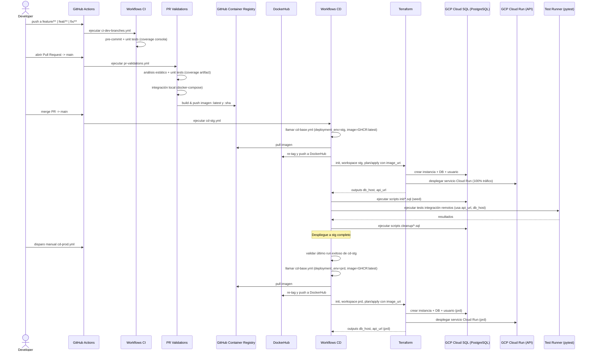
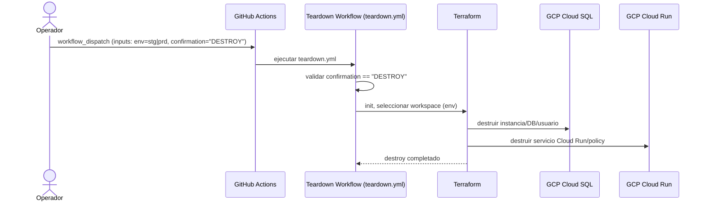

# Visión general

Este repositorio implementa una aplicación de registro y validación de tickets con una estrategia de ramas basada en trunk (trunk-based development), dos entornos (`stg` y `prd`), y una automatización CI/CD en GitHub Actions. La infraestructura se gestiona con Terraform sobre GCP (Cloud SQL para PostgreSQL y Cloud Run para el servicio API).

# Estrategia de ramas

- **Trunk-based development**: ramas cortas `feature/**`, `feat/**`, `fix/**` que se integran a `main` vía Pull Request.
- **Mapeo de entornos**:
  - **staging (`stg`)**: despliegue automático al fusionar a `main`.
  - **producción (`prd`)**: promoción manual y condicionada al éxito de `stg`.

# Entornos

- **Staging (`stg`)**: objetivo de pruebas para commits en `main`. Durante CD se aplica infraestructura, se inicializa la base de datos con SQLs de `src/db/scripts/init`, se ejecutan pruebas de integración y luego se limpian los datos de prueba con `src/db/scripts/cleanup`.
- **Producción (`prd`)**: despliegue manual; requiere que el último despliegue a `stg` haya sido exitoso.

# Pipelines de CI/CD

Los workflows viven en `.github/workflows/`.

- **Validaciones en ramas de desarrollo** (`ci-dev-branches.yml`)
  - **Disparo**: push a `feature/**`, `feat/**`, `fix/**`.
  - **Propósito**: feedback rápido de calidad.
  - **Flujo**: análisis estático reutilizable (pre-commit, unit tests con cobertura en consola).

- **Validaciones de Pull Request** (`pr-validations.yml`)
  - **Disparo**: `pull_request` → `main`.
  - **Propósito**: proteger integraciones a `main`.
  - **Flujo**:
    - Análisis estático (pre-commit, unit tests, artefacto de cobertura).
    - Pruebas de integración en modo local (Docker Compose).
    - Build y push de la imagen Docker a GHCR (`latest` y `sha`).

- **CD a Staging** (`cd-stg.yml`)
  - **Disparo**: push a `main` y manual.
  - **Propósito**: desplegar imagen verificada a `stg` y validar con pruebas de integración.
  - **Flujo**: llama al workflow base `cd-base.yml` con `deployment_env=stg` e imagen `ghcr.io/.../register-ticket-api:latest`.

- **CD a Producción** (`cd-prod.yml`)
  - **Disparo**: manual.
  - **Propósito**: promover a `prd` sólo si el último despliegue a `stg` fue exitoso.
  - **Flujo**: verifica último run de `cd-stg.yml` y, si fue exitoso, llama a `cd-base.yml` con `deployment_env=prd`.

- **Base de CD reutilizable** (`cd-base.yml`)
  - **Propósito**: estandarizar despliegues `stg`/`prd`.
  - **Flujo**:
    1. Promoción de imagen: pull desde GHCR → re-tag → push a DockerHub.
    2. Terraform: `init`/`workspace` por entorno, `plan`/`apply` con variables de entorno y `image_uri`.
    3. Salidas: `db_host` (IP pública de Cloud SQL) y `api_url` (URL de Cloud Run).
    4. Seed de base de datos: ejecutar `src/db/scripts/init/*.sql`.
    5. Pruebas de integración contra el entorno desplegado.
    6. Limpieza: ejecutar `src/db/scripts/cleanup/*.sql` (siempre, salvo entornos locales).

- **Teardown de emergencia** (`teardown.yml`)
  - **Disparo**: manual, requiere escribir “DESTROY”.
  - **Propósito**: destruir toda la infraestructura de `stg` o `prd` con Terraform.

## Estrategia de despliegue

### Despliegue de la API

- La imagen se construye en las validaciones de PR y se publica en GHCR con tags `latest` y el `sha` del commit.
- Los pipelines de CD promueven esa imagen: se re-etiqueta y publica en DockerHub (p. ej. `<dockerhub_user>/register-ticket-api:<tag>`).
- Terraform despliega la imagen en Cloud Run, exponiendo una URL pública y enroutando 100% del tráfico a la última revisión.

### Despliegue de la Base de Datos

- Terraform crea una instancia de Cloud SQL (PostgreSQL 15) con IP pública, base de datos y usuario por entorno.
- Durante el despliegue, se ejecutan los scripts SQL de `src/db/scripts/init` para crear esquema, SPs y datos iniciales.
- Tras las pruebas de integración, se ejecutan los scripts de `src/db/scripts/cleanup` para eliminar datos de prueba.

## Infraestructura con Terraform

- **Estado**: backend en GCS (`event-access-tfstate`).
- **Workspaces**: uno por entorno (`stg`, `prd`).
- **Recursos**:
  - Cloud SQL (PostgreSQL 15), base de datos y usuario.
  - Cloud Run para el servicio `register-ticket-api`, con acceso público (invoker `allUsers`).
  - Salidas: `db_host` (IP pública) y `cloud_run_service_url` (URL del servicio).

Archivos clave en `terraform/`:

- `main.tf`: define Cloud SQL y Cloud Run (inyecta `DB_HOST`, `DB_PORT`, `DB_USER`, `DB_PASSWORD`, `DB_NAME`).
- `variables.tf`: variables requeridas (`project_id`, `environment`, `db_*`, `image_uri`, etc.).
- `provider.tf`: backend de estado (GCS) y provider `google`.
- `outputs.tf`: `db_host`, `cloud_run_service_url`.
- `environments/*.tfvars`: valores por entorno.

## Estrategia de pruebas

### Unit tests

- Se ejecutan en el workflow reutilizable de análisis estático (`static-code-analysis.yml`).
- Herramientas: `pytest` con cobertura, gestionado con `uv`.
- Alcance: lógica de servicios, comportamiento de repositorios mediante mocks, validaciones y rutas de error.
- En PRs se sube artefacto de cobertura.

### Integration tests

- Dos modos de ejecución:
  - **Local (PR)**: levanta dependencias con `docker/docker-compose.yml`, carga variables desde `.env.test`, invoca la API local y valida efectos en DB (psycopg2).
  - **Remoto (CD)**: ejecuta contra `stg`/`prd` usando las salidas de Terraform (`api_url`, `db_host`) y credenciales desde secretos.
- Casos cubiertos (ejemplos en `tests/integration/`):
  - Registro exitoso de ticket y persistencia en DB.
  - Error al registrar ticket duplicado.
  - Error por payload inválido.
- Ciclo de datos (detalle):
  1) Tras el `apply` de Terraform, la instancia de Cloud SQL y la base de datos quedan disponibles.
  2) El pipeline ejecuta los SQL de `src/db/scripts/init/*.sql` (en orden):
     - `01_create_tables.sql`: crea tablas `users` y `tickets`, incluyendo PKs, restricciones (único seat+gate) y columnas necesarias (seed TOTP, `used_at`, `status`).
     - `02_create_ticket_stored_procedures.sql`: define el `PROCEDURE sp_register_ticket_to_user` para registrar tickets a usuarios, y la `FUNCTION fn_mark_ticket_as_used` para marcar el uso de un ticket.
     - `03_populate_tables.sql`: habilita `pgcrypto` y carga datos de prueba mínimos: dos usuarios (`spuertaf`, `juanperez`) y varios tickets con `seed` aleatorio y estado `valid`.
  3) Se ejecutan las pruebas de integración contra el ambiente desplegado, verificando conectividad API y DB:
     - La suite (p. ej. `tests/integration/test_tickets_registration.py`) hace llamadas HTTP a la API en Cloud Run (`BASE_URL`) y valida efectos en DB (`db_host`) vía `psycopg2` (fixtures `base_url` y `db_connection`).
     - Casos: alta de ticket para usuario; intentos duplicados; validación de errores.
  4) Si las pruebas de integración finalizan correctamente, se ejecutan los SQL de `src/db/scripts/cleanup/*.sql` para limpiar datos de prueba:
     - `01_drop_test_records.sql`: elimina tickets y usuarios insertados por los scripts de init (evita residuos entre deployments).

  Diagrama breve del ciclo de datos:

  ```mermaid
  sequenceDiagram
      participant CD as Workflow CD (cd-base)
      participant TF as Terraform
      participant DB as Cloud SQL (DB)
      participant API as Cloud Run (API)
      participant IT as Pruebas Integración

      CD->>TF: plan/apply (provisiona DB y API)
      TF-->>CD: outputs db_host, api_url
      CD->>DB: ejecutar init: 01_create_tables.sql
      CD->>DB: ejecutar init: 02_create_ticket_stored_procedures.sql
      CD->>DB: ejecutar init: 03_populate_tables.sql
      CD->>IT: correr tests contra API (api_url) y DB (db_host)
      IT-->>CD: resultados OK
      CD->>DB: ejecutar cleanup: 01_drop_test_records.sql
  ```

## Flujo extremo a extremo (E2E)

1. Push a rama `feature/**` → análisis estático y unit tests.
2. Pull Request a `main` → análisis estático + integración local + build & push de imagen a GHCR.
3. Merge a `main` → CD a `stg`: promoción de imagen, Terraform apply, seed DB, integración remota, cleanup.
4. Despliegue a `prd` (manual) → valida último run de `stg` y aplica el mismo proceso.

### Diagramas de secuencia

#### CI desde ramas/PR + CD a Staging y Producción



#### Teardown / Destroy de infraestructura



## Secretos y configuración

En GitHub Actions (por entorno):

- `GCP_SA_KEY`, `GCP_PROJECT_ID`
- `DB_NAME`, `DB_USER`, `DB_PASSWORD`
- `DOCKERHUB_USERNAME`, `DOCKERHUB_TOKEN`

Variables de Terraform por entorno en `terraform/environments/*.tfvars` (p. ej. `environment`, tamaños, etc.).