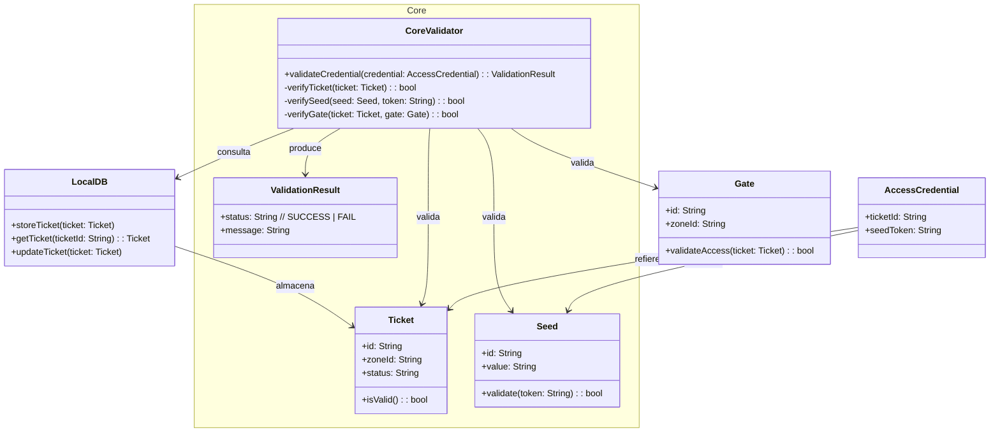
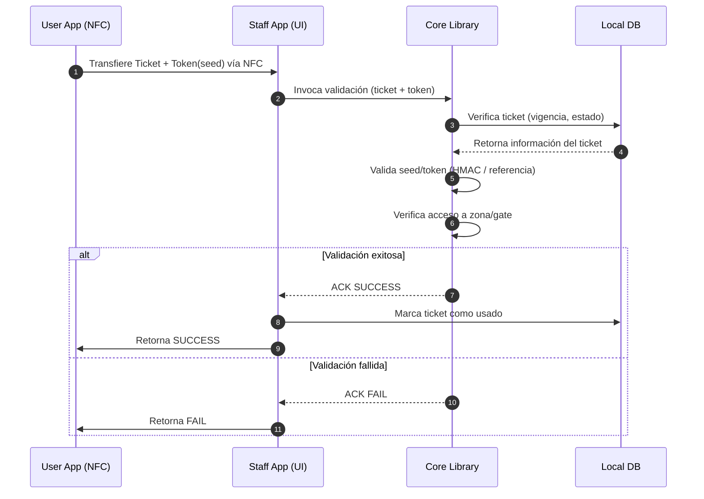
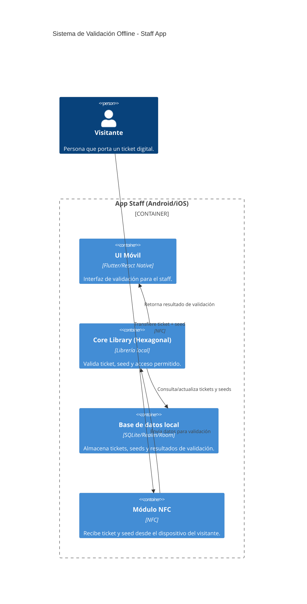

# Offline Ticket Validation
## Descripcion
Un visitante transfiere su ticket digital y una seed de seguridad al celular del staff mediante NFC. La App Staff, usando su Core Library, valida que la seed coincida con las almacenadas localmente y que el ticket tenga acceso permitido al gate correspondiente. Según el resultado, se autoriza o rechaza el ingreso directamente desde el dispositivo, sin necesidad de conexión a internet.
## Diagrama de clases

## Diagrama de secuencia

## Diagrama de contenedores

## Plan de pruebas unitarias
| ID   | Caso de prueba                                         | Entrada                                                                 | Proceso validado                                                                 | Resultado esperado                                                                 |
|------|---------------------------------------------------------|------------------------------------------------------------------------|----------------------------------------------------------------------------------|------------------------------------------------------------------------------------|
| TC01 | Validación exitosa de ticket con seed válida           | Ticket válido + seed válida                                             | Core valida ticket y compara seed con base local                                  | Retorna `SUCCESS`, se autoriza ingreso                                             |
| TC02 | Ticket válido pero seed inválida                       | Ticket válido + seed no registrada en el dispositivo staff              | Core valida ticket, falla en validación de seed                                   | Retorna `FAIL`, acceso denegado                                                    |
| TC03 | Ticket inválido                                        | Ticket no registrado en base local                                      | Core busca ticket en DB                                                           | Retorna `FAIL`, acceso denegado                                                    |
| TC04 | Ticket válido pero no autorizado en gate específico    | Ticket válido + seed válida pero sin acceso al gate en contexto         | Core valida ticket, compara zona/gate                                             | Retorna `FAIL`, acceso denegado                                                    |
| TC05 | Ticket válido previamente usado                        | Ticket válido + seed válida pero ya marcado como “usado” en la base     | Core valida ticket, detecta estado previo                                         | Retorna `FAIL`, acceso denegado                                                    |
| TC06 | Seed válida pero formato corrupto en el ticket         | Ticket con estructura alterada + seed válida                            | Core intenta parsear ticket                                                       | Lanza excepción de validación / retorna `FAIL`                                     |
| TC07 | Validación simultánea en múltiples gates (consistencia)| Ticket válido + seed válida (2 nodos en gossip network con BD local)    | Core valida ticket y módulo gossip propaga cambio                                 | Ambos nodos registran ticket como “usado” y no lo aceptan nuevamente               |
| TC08 | Ticket válido con seed expirada                        | Ticket válido + seed válida pero expirada                               | Core valida vigencia de seed                                                      | Retorna `FAIL`, acceso denegado                                                    |
| TC09 | Reconexión de nodo con tickets validados offline       | Nodo staff se reconecta con base desactualizada                         | Gossip propaga tickets validados previamente                                      | Nodo actualiza su DB local correctamente                                           |
| TC10 | Validación de performance (tiempo de respuesta)        | Ticket válido + seed válida                                             | Core procesa validación offline                                                   | Respuesta en < 300ms                                                               |