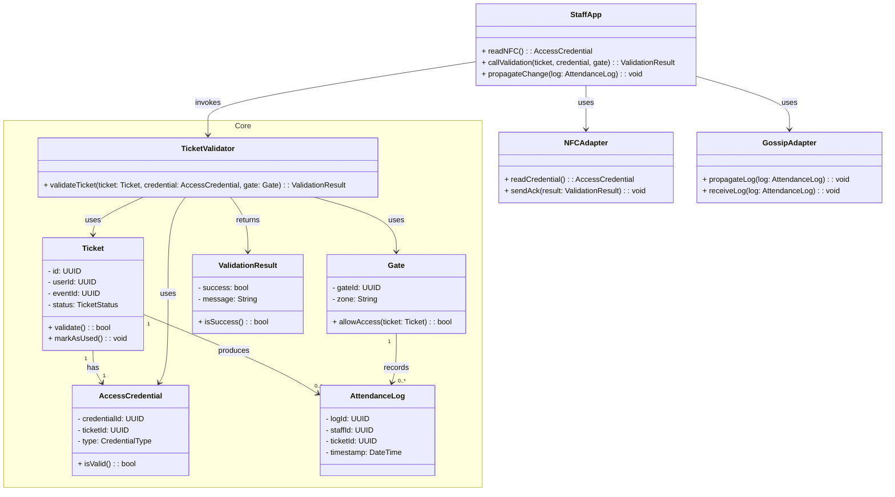
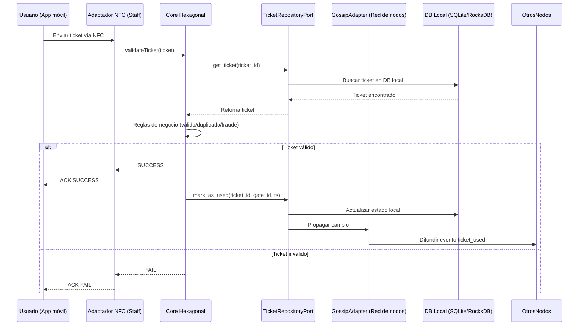
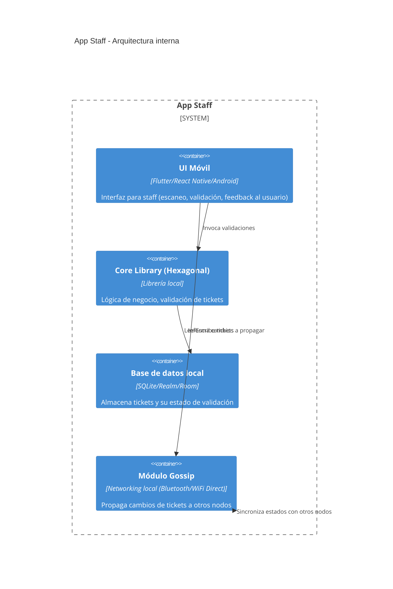

# Offline Ticket Validation
## Descripcion
El miembro del staff utiliza la aplicación móvil para validar la entrada de un usuario, quien comparte su credencial (ticket) mediante NFC. La app ejecuta la validación a través del core local y actualiza el estado del ticket en la base de datos interna. Luego, el cambio se propaga entre los dispositivos del staff conectados al mismo gate/zona mediante un protocolo de gossip, asegurando que todos los nodos mantengan un estado sincronizado aun sin conexión a internet.
## Diagrama de clases

## Diagrama de secuencia

## Diagrama contenedores (Staff App)

## Plan de pruebas unitarias
| **ID** | **Clase / Módulo** | **Método a probar** | **Descripción de la prueba**                                 | **Entrada**                          | **Salida esperada**                               |
| ------ | ------------------ | ------------------- | ------------------------------------------------------------ | ------------------------------------ | ------------------------------------------------- |
| TC-01  | `Ticket`           | `__init__`          | Crear un ticket con datos válidos.                           | `id="T1", content="data1"`           | Ticket con `id="T1"`, `content="data1"`.          |
| TC-02  | `Ticket`           | `update_content`    | Actualizar el contenido de un ticket.                        | `content="nuevo valor"`              | El ticket refleja el nuevo contenido.             |
| TC-03  | `Ticket`           | `__eq__`            | Comparar dos tickets iguales.                                | `Ticket("T1") == Ticket("T1")`       | `True`.                                           |
| TC-04  | `Ticket`           | `__eq__`            | Comparar dos tickets diferentes.                             | `Ticket("T1") == Ticket("T2")`       | `False`.                                          |
| TC-05  | `Node`             | `__init__`          | Crear nodo con identificador válido.                         | `node_id="N1"`                       | Nodo con `id="N1"`, lista de tickets vacía.       |
| TC-06  | `Node`             | `add_ticket`        | Asociar un ticket a un nodo.                                 | `node.add_ticket(Ticket("T1"))`      | El nodo contiene el ticket.                       |
| TC-07  | `Node`             | `get_ticket`        | Recuperar ticket existente.                                  | `node.get_ticket("T1")`              | Retorna el ticket correcto.                       |
| TC-08  | `Node`             | `get_ticket`        | Intentar recuperar ticket inexistente.                       | `node.get_ticket("T999")`            | Retorna `None` o lanza excepción controlada.      |
| TC-09  | `Node`             | `update_ticket`     | Actualizar ticket existente en el nodo.                      | `update_ticket("T1", "nuevo valor")` | Ticket actualizado.                               |
| TC-10  | `Node`             | `update_ticket`     | Intentar actualizar ticket inexistente.                      | `update_ticket("T999", "valor")`     | Excepción `TicketNotFoundError`.                  |
| TC-11  | `Node`             | `list_tickets`      | Listar todos los tickets del nodo.                           | Tickets `T1, T2`                     | Retorna lista `[T1, T2]`.                         |
| TC-12  | `Core`             | `register_node`     | Registrar un nodo en el core.                                | `core.register_node(Node("N1"))`     | Nodo agregado en la lista del core.               |
| TC-13  | `Core`             | `find_node`         | Buscar nodo existente.                                       | `find_node("N1")`                    | Retorna el nodo correcto.                         |
| TC-14  | `Core`             | `find_node`         | Buscar nodo inexistente.                                     | `find_node("N999")`                  | Retorna `None` o excepción `NodeNotFoundError`.   |
| TC-15  | `Core`             | `propagate_change`  | Propagar actualización de ticket a varios nodos registrados. | Actualizar `T1` en `N1`              | Todos los nodos con `T1` reflejan el nuevo valor. |
| TC-16  | `Core`             | `propagate_change`  | Intentar propagar un ticket inexistente.                     | `T999`                               | Excepción `TicketNotFoundError`.                  |
